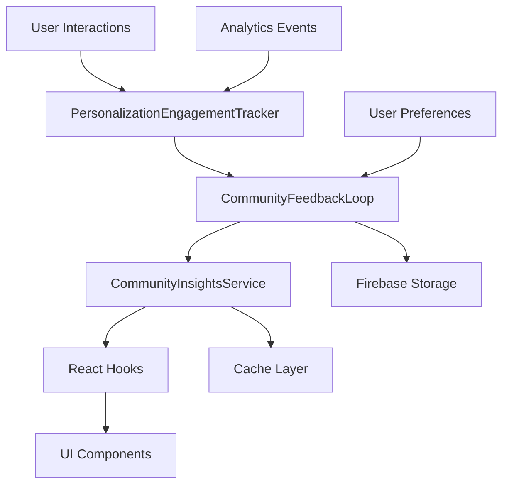

# Community Feedback Loop & Personalization System Documentation

## Overview

This document provides comprehensive documentation for the Community Feedback Loop system and enhanced personalization features implemented in the Dekr application. The system aggregates user personalization data to create community sentiment analysis, trending insights, and actionable recommendations.

## Table of Contents

1. [System Architecture](#system-architecture)
2. [Core Components](#core-components)
3. [Data Flow](#data-flow)
4. [API Reference](#api-reference)
5. [Usage Examples](#usage-examples)
6. [Configuration](#configuration)
7. [Performance Considerations](#performance-considerations)
8. [Troubleshooting](#troubleshooting)

## System Architecture

### High-Level Overview

```
User Interactions → Engagement Tracker → Community Feedback Loop → Intelligence Reports → UI Components
```

The system operates on a continuous feedback loop where:
1. User interactions are tracked in real-time
2. Data is aggregated every 15 minutes
3. Community insights are generated and cached
4. UI components consume insights for enhanced user experience

### Component Relationships



## Core Components

### 1. PersonalizationEngagementTracker

**File:** `services/PersonalizationEngagementTracker.ts`

Tracks user engagement metrics for different personalization modes and collects community contribution data.

#### Key Features
- Session-based engagement tracking
- Real-time interaction monitoring
- Community data contribution
- Personalization mode comparison

#### Main Methods

```typescript
// Start tracking a personalization session
async startPersonalizationSession(
  userId: string, 
  mode: 'personalized' | 'general',
  sessionId: string
): Promise<void>

// Track card interactions
async trackCardInteraction(
  sessionId: string,
  action: 'view' | 'swipe' | 'save' | 'share',
  cardId: string,
  timeSpent?: number
): Promise<void>

// End session and collect community data
async endPersonalizationSession(
  sessionId: string,
  satisfactionRating?: number,
  feedback?: string
): Promise<PersonalizationEngagementMetrics | null>
```

#### Data Structures

```typescript
interface PersonalizationEngagementMetrics {
  userId: string;
  mode: 'personalized' | 'general';
  sessionId: string;
  startTime: Date;
  endTime?: Date;
  cardsViewed: number;
  cardsSwiped: number;
  cardsSaved: number;
  cardsShared: number;
  averageTimePerCard: number;
  engagementScore: number;
  satisfactionRating?: number;
  feedback?: string;
}
```

### 2. CommunityFeedbackLoop

**File:** `services/CommunityFeedbackLoop.ts`

Core service that aggregates community data for sentiment analysis and personalization insights.

#### Key Features
- Periodic data aggregation (15-minute intervals)
- Community sentiment analysis
- Personalization effectiveness tracking
- Intelligence report generation

#### Main Methods

```typescript
// Collect user contribution data
async collectUserContribution(
  userId: string, 
  contribution: Partial<UserContribution>
): Promise<void>

// Aggregate community data
async aggregateCommunityData(): Promise<CommunityIntelligenceReport>

// Get latest intelligence report
async getLatestIntelligenceReport(): Promise<CommunityIntelligenceReport | null>

// Get community sentiment for specific asset
async getCommunitySentiment(assetSymbol: string): Promise<CommunitySentimentData | null>
```

#### Data Structures

```typescript
interface CommunitySentimentData {
  assetSymbol: string;
  assetType: 'stock' | 'crypto' | 'news' | 'lesson' | 'podcast';
  overallSentiment: 'bullish' | 'bearish' | 'neutral';
  sentimentScore: number; // -1 to 1
  confidence: number; // 0 to 1
  totalInteractions: number;
  positiveInteractions: number;
  negativeInteractions: number;
  neutralInteractions: number;
  trendingDirection: 'up' | 'down' | 'stable';
  momentumScore: number;
  communityEngagement: {
    views: number;
    saves: number;
    shares: number;
    comments: number;
  };
  demographicBreakdown: {
    byExperience: {
      beginner: { count: number; sentiment: number };
      intermediate: { count: number; sentiment: number };
      expert: { count: number; sentiment: number };
    };
    byAge: {
      under25: { count: number; sentiment: number };
      '25-35': { count: number; sentiment: number };
      '35-45': { count: number; sentiment: number };
      over45: { count: number; sentiment: number };
    };
  };
  timestamp: Date;
  lastUpdated: Date;
}
```

### 3. CommunityInsightsService

**File:** `services/CommunityInsightsService.ts`

Provides processed community insights to the UI with caching and optimization.

#### Key Features
- Dashboard data aggregation
- Trending assets analysis
- Personalization effectiveness metrics
- Caching system (5-minute cache)

#### Main Methods

```typescript
// Get complete community dashboard
async getCommunityDashboard(): Promise<CommunityDashboard>

// Get trending assets
async getTrendingAssets(limit: number = 10): Promise<TrendingAsset[]>

// Get asset sentiment
async getAssetSentiment(assetSymbol: string): Promise<CommunitySentimentData | null>

// Get personalization effectiveness
async getPersonalizationEffectiveness(): Promise<PersonalizationEffectiveness>
```

### 4. React Hooks

**File:** `hooks/useCommunityInsights.ts`

React hooks for easy integration of community insights into UI components.

#### Available Hooks

```typescript
// Complete community dashboard
const {
  dashboard,
  trendingAssets,
  personalizationEffectiveness,
  communityInsights,
  loading,
  error,
  refresh,
  getAssetSentiment
} = useCommunityInsights();

// Specific asset sentiment
const { sentiment, loading, error } = useAssetSentiment('AAPL');

// Trending assets
const { trendingAssets, loading, error } = useTrendingAssets(10);

// Personalization effectiveness
const { effectiveness, loading, error } = usePersonalizationEffectiveness();
```

## Data Flow

### 1. User Interaction Tracking

```typescript
// User performs action (swipe, save, share)
handleSwipeRight(cardIndex) {
  // Track engagement
  personalizationEngagementTracker.trackCardInteraction(
    currentSessionId,
    'save',
    card.id
  );
}
```

### 2. Session Data Collection

```typescript
// Session ends
useEffect(() => {
  return () => {
    if (currentSessionId && user) {
      personalizationEngagementTracker.endPersonalizationSession(currentSessionId);
    }
  };
}, [currentSessionId, user]);
```

### 3. Community Data Aggregation

```typescript
// Automatic aggregation every 15 minutes
setInterval(async () => {
  await communityFeedbackLoop.aggregateCommunityData();
}, 15 * 60 * 1000);
```

### 4. UI Consumption

```typescript
// Component uses community insights
const { dashboard, loading } = useCommunityInsights();

if (loading) return <LoadingSpinner />;

return (
  <View>
    <Text>Community Sentiment: {dashboard.summary.averageSentiment}</Text>
    <Text>Trending Assets: {dashboard.summary.topTrendingAssets.join(', ')}</Text>
  </View>
);
```

## API Reference

### Analytics Events

The system tracks the following analytics events:

```typescript
// Personalization events
PERSONALIZATION_TOGGLED: 'personalization_toggled'
PERSONALIZATION_FEEDBACK: 'personalization_feedback'

// Session events
START_SESSION: 'start_session'
END_SESSION: 'end_session'

// Performance tracking
TRACK_PERFORMANCE: 'track_performance'
TRACK_FEATURE_USAGE: 'track_feature_usage'
```

### Firebase Collections

The system uses the following Firebase collections:

```typescript
// User session data
'personalization_sessions'

// User contributions
'community_contributions'

// Intelligence reports
'community_intelligence_reports'

// Personalization comparisons
'personalization_comparisons'
```

### Configuration Options

```typescript
// Aggregation interval (default: 15 minutes)
const AGGREGATION_INTERVAL = 15 * 60 * 1000;

// Cache timeout (default: 5 minutes)
const CACHE_TIMEOUT = 5 * 60 * 1000;

// Engagement score weights
const ENGAGEMENT_WEIGHTS = {
  cardsViewed: 0.2,
  cardsSwiped: 0.3,
  cardsSaved: 0.3,
  cardsShared: 0.2,
};
```

## Usage Examples

### 1. Basic Community Dashboard

```typescript
import { useCommunityInsights } from '../hooks/useCommunityInsights';

function CommunityDashboard() {
  const { dashboard, loading, error, refresh } = useCommunityInsights();

  if (loading) return <ActivityIndicator />;
  if (error) return <Text>Error: {error}</Text>;

  return (
    <ScrollView>
      <Text>Total Users: {dashboard.summary.totalUsers}</Text>
      <Text>Average Sentiment: {dashboard.summary.averageSentiment.toFixed(2)}</Text>
      <Text>Top Trending: {dashboard.summary.topTrendingAssets.join(', ')}</Text>
      
      <Button onPress={refresh} title="Refresh Data" />
    </ScrollView>
  );
}
```

### 2. Asset Sentiment Display

```typescript
import { useAssetSentiment } from '../hooks/useCommunityInsights';

function AssetCard({ symbol }) {
  const { sentiment, loading } = useAssetSentiment(symbol);

  if (loading) return <ActivityIndicator />;

  return (
    <Card>
      <Text>{symbol}</Text>
      <Text>Sentiment: {sentiment?.overallSentiment}</Text>
      <Text>Confidence: {(sentiment?.confidence * 100).toFixed(1)}%</Text>
      <Text>Trending: {sentiment?.trendingDirection}</Text>
    </Card>
  );
}
```

### 3. Personalization Effectiveness

```typescript
import { usePersonalizationEffectiveness } from '../hooks/useCommunityInsights';

function PersonalizationStats() {
  const { effectiveness, loading } = usePersonalizationEffectiveness();

  if (loading) return <ActivityIndicator />;

  return (
    <View>
      <Text>Engagement Rate: {effectiveness.effectiveness.engagementRate.toFixed(1)}%</Text>
      <Text>Satisfaction Score: {effectiveness.effectiveness.satisfactionScore.toFixed(1)}%</Text>
      <Text>Retention Rate: {effectiveness.effectiveness.retentionRate.toFixed(1)}%</Text>
      
      <Text>Most Effective For:</Text>
      {effectiveness.userPreferences.mostEffectiveFor.map(pref => (
        <Text key={pref}>• {pref}</Text>
      ))}
    </View>
  );
}
```

### 4. Trending Assets List

```typescript
import { useTrendingAssets } from '../hooks/useCommunityInsights';

function TrendingAssetsList() {
  const { trendingAssets, loading } = useTrendingAssets(5);

  if (loading) return <ActivityIndicator />;

  return (
    <FlatList
      data={trendingAssets}
      keyExtractor={item => item.symbol}
      renderItem={({ item }) => (
        <Card>
          <Text>{item.symbol} - {item.name}</Text>
          <Text>Sentiment: {item.sentiment}</Text>
          <Text>Engagement: {item.engagement}</Text>
          <Text>Trending: {item.trendingDirection}</Text>
        </Card>
      )}
    />
  );
}
```

## Configuration

### Environment Variables

```bash
# Firebase configuration (already configured)
EXPO_PUBLIC_FIREBASE_API_KEY=your_api_key
EXPO_PUBLIC_FIREBASE_AUTH_DOMAIN=your_domain
EXPO_PUBLIC_FIREBASE_PROJECT_ID=your_project_id

# Analytics configuration
EXPO_PUBLIC_ANALYTICS_ENABLED=true
```

### Firebase Security Rules

```javascript
// Firestore rules for community data
rules_version = '2';
service cloud.firestore {
  match /databases/{database}/documents {
    // Personalization sessions
    match /personalization_sessions/{sessionId} {
      allow read, write: if request.auth != null;
    }
    
    // Community contributions
    match /community_contributions/{userId} {
      allow read, write: if request.auth != null && request.auth.uid == userId;
    }
    
    // Intelligence reports (read-only for users)
    match /community_intelligence_reports/{reportId} {
      allow read: if request.auth != null;
      allow write: if false; // Only system can write
    }
  }
}
```

## Performance Considerations

### Caching Strategy

- **Community Insights**: 5-minute cache
- **Asset Sentiment**: 5-minute cache
- **Trending Assets**: 5-minute cache
- **Dashboard Data**: 5-minute cache

### Data Aggregation

- **Real-time**: User interactions tracked immediately
- **Batch Processing**: Community data aggregated every 15 minutes
- **Background Processing**: Non-blocking aggregation
- **Error Handling**: Graceful fallbacks for failed aggregations

### Memory Management

- **Session Cleanup**: Automatic cleanup of completed sessions
- **Cache Limits**: Maximum 100 cached items
- **Memory Monitoring**: Automatic cache eviction

### Firebase Optimization

- **Batch Writes**: Multiple operations batched together
- **Indexed Queries**: Optimized database queries
- **Data Pagination**: Large datasets paginated
- **Connection Pooling**: Efficient Firebase connections

## Troubleshooting

### Common Issues

#### 1. Community Data Not Updating

**Symptoms**: Dashboard shows stale data
**Solutions**:
- Check if aggregation is running: `communityFeedbackLoop.aggregateCommunityData()`
- Verify Firebase permissions
- Check network connectivity
- Clear cache: `communityInsightsService.clearCache()`

#### 2. Engagement Tracking Not Working

**Symptoms**: Session data not being collected
**Solutions**:
- Verify session ID is set: `currentSessionId`
- Check user authentication status
- Ensure engagement tracker is initialized
- Verify analytics events are firing

#### 3. Sentiment Analysis Errors

**Symptoms**: Sentiment scores showing as 0 or NaN
**Solutions**:
- Check if user contributions exist
- Verify sentiment calculation logic
- Ensure sufficient interaction data
- Check demographic breakdown data

#### 4. Performance Issues

**Symptoms**: Slow loading or high memory usage
**Solutions**:
- Reduce cache timeout
- Limit trending assets count
- Implement data pagination
- Check Firebase query optimization

### Debug Mode

Enable debug logging:

```typescript
// In development
if (__DEV__) {
  console.log('Community Feedback Loop Debug Mode Enabled');
  // Enable verbose logging
}
```

### Monitoring

Key metrics to monitor:

- **Aggregation Success Rate**: Should be >95%
- **Cache Hit Rate**: Should be >80%
- **Session Completion Rate**: Should be >90%
- **Data Freshness**: Reports should be <20 minutes old

## Future Enhancements

### Planned Features

1. **Real-time WebSocket Updates**: Live community sentiment updates
2. **Machine Learning Integration**: Advanced sentiment analysis
3. **Predictive Analytics**: Trend forecasting
4. **Advanced Demographics**: More detailed user segmentation
5. **API Endpoints**: External access to community insights

### Scalability Considerations

- **Horizontal Scaling**: Multiple aggregation workers
- **Database Sharding**: Partition data by region/time
- **CDN Integration**: Cache insights globally
- **Microservices**: Split into independent services

## Support

For technical support or questions about the Community Feedback Loop system:

1. Check this documentation first
2. Review the code comments in service files
3. Check Firebase console for data issues
4. Monitor analytics events in Firebase Analytics
5. Contact the development team for complex issues

---

**Last Updated**: January 2025
**Version**: 1.0.0
**Maintainer**: Dekr Development Team
